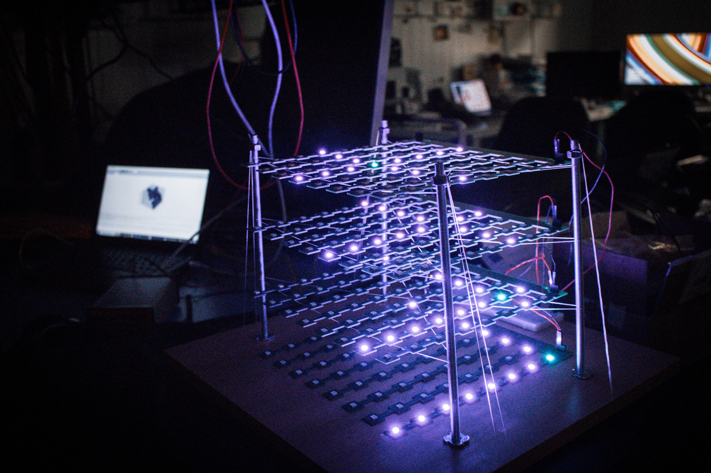

Plastic Scintillation Detector Visualization Setup: An array of LEDs which are lit blue-violet if the energy of a particle passing thru was detected in the corresponding detector segments, and green for the interpolated path.
Image provided by [CERN](https://home.cern/) - usage only under the terms described in [COPYRIGHT.md](COPYRIGHT.md).

# PSD - Plastic Scintillation Detector
A Plastic Scintillation Detector (PSD) is specific kind of particle detector, on which I worked on during my time at CERN, and of which I built a functioning Exhibition prototype for IdeaSquare.

In the following a summarized rundown of the project - for the complete theory refer to psd.md.

## Theory
When a particle travels through a material, the particle has a certain chance of interacting with that material. Depending on the interaction, energy can be transfered into the material, briefly stored and then sent back out (emmitted) in the form of light. This process is called Scintillation. 
If the material allows for this light to travell through (aka is transparent to this light), we can observe that light once it leaves the material. Based on where and when we see that light, we can reconstruct the path the particle took, and the amount of energy it transferred into the material at each place. When we combine Path and energy transfer, we obtain a signature unique to every kind of particle. This signature identifies the particle for us. (Actually to be able to distinct between a charged particle and its anti particle we need to apply a strong magnetic field, which causes the paths of particle and anti particle to differ, from which we can distinguish these two).

The tricky part is that in practice the light emmited from the scintillation process, is very little, and the number of particles travelling through the material can be very high. This makes it difficult to detect particles, physicist apply many sophisticated methods to have highly sensitive light detectors, convert the light into electrical signals, and amplify these electrical signals, while at the same time narrow down the which part of the material the signal came from. If you can narrow down where the signal came from you can narrow down the part of the materials which the signals came from, you can distinguish the signatures of all the particles which travelled through the material and interacted with it, and from that identify them.

## Hardware
Essential to the build are:
- **the detector**, consisting of plastic scintillating cubes, special fibers, custom adapters, custom cables, and multi input channels Pre-amps
- **a laptop**, with the software mentioned bellow
- **the Visualization setup**, consisting of custom LEB PCBs, arduino, power supply circuit

## Software
The build of this Prototype required adaptation of hardware controlling firmware which is proprietary and thus will not be shared. Let me tell you - going through thousands of lines of code, many many files, figuring out what to add, and making sure it is correct. Luckily for me I had needed to make these adaptations for previous R&D experiments anyways.
To read out and visualize the files containing the measurements, a visual programm that can communicate with the arduino controlling the LED Visualization setup was created, as well as an arduino programm that communicates with the prior programm plus coordinates the LEDs.

## Documentation
With that prototype I created an extensive documentation containing theors, setup and maintenance information, as well as contact details to manufacturers and experts in case of occuring issues. As the documentation contained confidential information, I need to see what I can upload, and what I need to censor before I can upload it here.

